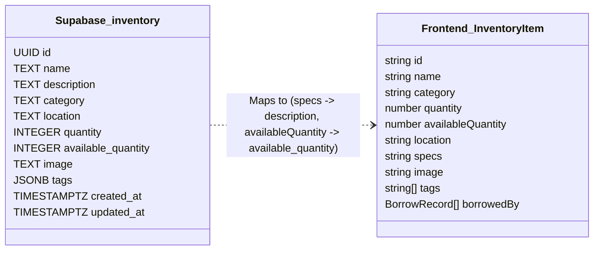

# CICR VAULT — System & Issue Tracking Logs

This document serves as the centralized master log for **CICR VAULT (cicr-inventory)**, cataloging all active GitHub tracking issues, public endpoint security assessments, frontend state & lifecycle audits, authentication UX & form validation matrices, and data schema parity status.

---

## 1. Active GitHub Issues & Technical Debt Registry

The following table tracks all open issues currently registered in the repository's [GitHub Issues Tab](https://github.com/simplyvardaan/cicr-inventory/issues):

| Issue # | Scope | Priority | Title & Objective | Key Files / Endpoints Affected |
| :---: | :---: | :---: | :--- | :--- |
| **[#55](https://github.com/simplyvardaan/cicr-inventory/issues/55)** | `Security / Auth` | **Medium** | **Clear sensitive plain-text passwords from DOM memory after submission**<br>Reset `loginPassInp.value` and `signupPassInp.value` to empty strings immediately following payload transmission to avoid in-memory credential retention. | `src/main.ts` |
| **[#54](https://github.com/simplyvardaan/cicr-inventory/issues/54)** | `Frontend / Auth` | **Low/Med** | **Reset avatar image state in sidebar on account switch**<br>Explicitly reset `sidebarAvatarImg.src = ''` when logging in with an account that has no `avatar_url` to avoid displaying the previous user's avatar. | `src/main.ts` |
| **[#53](https://github.com/simplyvardaan/cicr-inventory/issues/53)** | `Frontend / UX` | **Medium** | **Align signup form label and validator for Academic Branch vs Lab Batch**<br>Standardize contradictory HTML placeholder (`CSE/ECE/IT`) and TypeScript error message (`lab section batch F1/F2`) to Academic Branch. | `index.html`<br>`src/main.ts` |
| **[#52](https://github.com/simplyvardaan/cicr-inventory/issues/52)** | `Frontend / Auth` | **High** | **Remove hardcoded admin emails in client-side login validation**<br>Eliminate client-side hardcoded `currentAdmins` array in `isAllowedEmail()` so newly promoted/registered administrators can authenticate. | `src/main.ts` |
| **[#51](https://github.com/simplyvardaan/cicr-inventory/issues/51)** | `Frontend / UX` | **High** | **Prevent double-submit & add in-flight loading states on login/signup forms**<br>Disable submit buttons with a spinner/loading indicator during `await fetch()` calls to eliminate duplicate requests and 429 rate limits. | `src/main.ts`<br>`index.html` |
| **[#50](https://github.com/simplyvardaan/cicr-inventory/issues/50)** | `Frontend / Auth` | **High** | **Add password confirmation field & match validation in signup modal**<br>Provide `#signup-confirm-password` and client-side match validation to prevent accidental student typos from permanently locking accounts. | `index.html`<br>`src/main.ts` |
| **[#49](https://github.com/simplyvardaan/cicr-inventory/issues/49)** | `Security / Authz` | **Critical** | **Direct `/api/borrow` checkout bypasses admin approval for regular members**<br>Add `requireAdmin` or redirect members to `/api/borrow/request` to eliminate direct unapproved inventory checkout bypass. | `backend/src/modules/borrow/borrow.routes.ts`<br>`backend/src/modules/borrow/borrow.controller.ts` |
| **[#48](https://github.com/simplyvardaan/cicr-inventory/issues/48)** | `Frontend / Sync` | **Medium** | **Implement cross-tab localStorage synchronization via `storage` event listener**<br>Ensure multi-tab sessions stay synchronized when tokens, roles, themes, or cart quantities change in sibling tabs. | `src/main.ts` |
| **[#47](https://github.com/simplyvardaan/cicr-inventory/issues/47)** | `Frontend / Perf` | **Medium** | **Optimize Three.js particle animation loop & respect `prefers-reduced-motion`**<br>Stop re-uploading particle buffer attributes on every CPU frame (`needsUpdate = true`); support accessibility reduced-motion settings. | `src/main.ts` |
| **[#46](https://github.com/simplyvardaan/cicr-inventory/issues/46)** | `Frontend / A11y` | **Medium** | **Add ARIA dialog semantics and keyboard focus trapping to modals**<br>Provide `role="dialog"`, `aria-modal="true"`, and enforce strict Tab key containment inside active modal dialogs. | `index.html`<br>`src/main.ts` |
| **[#45](https://github.com/simplyvardaan/cicr-inventory/issues/45)** | `Frontend / UX` | **Medium** | **Prevent Flash of Unstyled Theme (FOUC) on initial page load**<br>Inject early synchronous `<script>` in `<head>` to read `cicr_vault_theme` before HTML rendering to eliminate theme flicker for Robo Lab light mode. | `index.html` |
| **[#44](https://github.com/simplyvardaan/cicr-inventory/issues/44)** | `Frontend / Auth` | **High** | **Clear hardware cart and pending requests on user logout**<br>Purge `cicr_cart_items`, `cicr_pending_returns`, and `cicr_requests` on sign-out to prevent data leakage across shared university workstations. | `src/main.ts` |
| **[#43](https://github.com/simplyvardaan/cicr-inventory/issues/43)** | `Frontend / Bug` | **High** | **Fix phantom request submission on network/API failure**<br>Stop optimistically caching requests locally and showing "Request Transmitted" when backend `POST /api/borrow/request` fails. | `src/main.ts` |
| **[#42](https://github.com/simplyvardaan/cicr-inventory/issues/42)** | `Security / System` | **Medium** | **Enforce authentication & rate limiting on `/api/system/` metrics & simulation endpoints**<br>Add admin gating or strict rate limits to prevent unauthenticated arbitrary load generation via `/api/system/simulate-scale`. | `backend/src/routes/system.routes.ts`<br>`backend/src/modules/system/system.controller.ts` |
| **[#41](https://github.com/simplyvardaan/cicr-inventory/issues/41)** | `Security / Privacy` | **High** | **Restrict public `/api/borrow/admins` directory endpoint to authenticated users**<br>Enforce `authenticateToken` on admin directory queries to prevent unauthenticated scraping of administrator names, IDs, and email contacts. | `backend/src/modules/borrow/borrow.routes.ts`<br>`backend/src/modules/borrow/borrow.controller.ts` |
| **[#40](https://github.com/simplyvardaan/cicr-inventory/issues/40)** | `Security / Auth` | **Critical** | **Fix insecure reset-password flow & account enumeration on public auth endpoints**<br>Eliminate contradiction between decommissioned OTP messaging and `current_password` requirements; sanitize 404 user-not-found errors to prevent student account enumeration. | `backend/src/modules/auth/auth.routes.ts`<br>`backend/src/modules/auth/auth.controller.ts` |
| **[#39](https://github.com/simplyvardaan/cicr-inventory/issues/39)** | `Security / API` | **High** | **Restrict or remove unauthenticated `/api/smtp-debug` diagnostic endpoint**<br>Remove or admin-gate the public diagnostic endpoint that probes external Gmail SMTP sockets and reveals internal environment configurations. | `backend/src/app.ts` |
| **[#38](https://github.com/simplyvardaan/cicr-inventory/issues/38)** | `Frontend / Error` | **Medium** | **API response error boundary & safe schema parsing guards**<br>Implement defensive response parsing to gracefully intercept 502/503 HTML gateway timeouts or malformed JSON without crashing the DOM execution loop. | `src/main.ts`<br>`src/api.ts` |
| **[#37](https://github.com/simplyvardaan/cicr-inventory/issues/37)** | `Frontend / Borrow` | **Medium** | **Typed frontend integration with `/api/borrow/` lifecycle endpoints**<br>Implement strict TypeScript interfaces for multi-item checkout (`BulkBorrowRequestPayload`), partial return steppers (`ReturnRequestPayload`), and admin ledger management. | `src/types.ts`<br>`src/main.ts`<br>`backend/src/modules/borrow/*` |
| **[#36](https://github.com/simplyvardaan/cicr-inventory/issues/36)** | `Frontend / API` | **High** | **Centralize API endpoint service layer & eliminate scattered raw `fetch` calls**<br>Extract 24+ raw `fetch` invocations into a structured `src/api.ts` client with namespace-based methods, automatic Bearer JWT injection, and unified error handling. | `src/api.ts`<br>`src/main.ts`<br>`backend/src/app.ts` |
| **[#35](https://github.com/simplyvardaan/cicr-inventory/issues/35)** | `Frontend / Types` | **High** | **Modernize `src/types.ts` for full parity with live Supabase schema**<br>Replace legacy interfaces (`specs`, `availableQuantity`) with direct database shapes (`available_quantity`, `description`, `DbUser`, `DbBorrowRecord`, `DbAuditLog`) and standardized generic `ApiResponse<T>` wrappers. | `src/types.ts`<br>`src/main.ts`<br>`ER_DIAGRAM.md` |
| **[#34](https://github.com/simplyvardaan/cicr-inventory/issues/34)** | `Network / Failover` | **High** | **Client-side fetch retry with exponential backoff for cold starts**<br>Wrap idempotent `GET` endpoints in an exponential backoff utility (1s, 2s) to absorb Render cloud sleep/wake-up delays without requiring manual browser reloads. | `src/main.ts`<br>`src/api.ts` |
| **[#33](https://github.com/simplyvardaan/cicr-inventory/issues/33)** | `Mobile / UI` | **Medium** | **Modal backdrop scroll bleed & touch focus trapping on mobile viewports**<br>Enforce strict body scroll locking (`document.body.style.overflow = 'hidden'`) and `overscroll-behavior: contain` when modals (Cart, Stepper) are active. | `src/style.css`<br>`src/main.ts`<br>`index.html` |
| **[#32](https://github.com/simplyvardaan/cicr-inventory/issues/32)** | `Dashboard / Perf` | **Medium** | **Virtualize or paginate Audit Logs and Borrow History views**<br>Prevent DOM node bloating under large institutional history sets by implementing backend cursor/offset pagination and frontend virtual rendering or "Load More" controls. | `src/main.ts`<br>`backend/src/modules/dashboard/*` |
| **[#31](https://github.com/simplyvardaan/cicr-inventory/issues/31)** | `Database / Schema` | **Medium** | **Enforce referential integrity & foreign keys between audit logs and borrow records**<br>Add optional `borrow_record_id` foreign key referencing `borrow_records(id)` on `audit_logs` to maintain cascade consistency during loan record pruning or archiving. | `backend/src/modules/borrow/*`<br>`backend/migrations/*`<br>`ER_DIAGRAM.md` |
| **[#30](https://github.com/simplyvardaan/cicr-inventory/issues/30)** | `Auth / Session` | **High** | **Add JWT expiry interceptor & automatic session refresh flow**<br>Intercept `401 Unauthorized` responses in the client `fetch` pipeline, purge stale localStorage state, and show a clean session-expired toast with automatic login modal prompt. | `src/main.ts`<br>`src/api.ts`<br>`backend/src/middleware/auth.middleware.ts` |
| **[#29](https://github.com/simplyvardaan/cicr-inventory/issues/29)** | `Cart / Concurrency` | **High** | **Concurrent hardware cart checkout race condition & stock verification**<br>Add pre-checkout stock re-validation before executing bulk borrow dispatch to prevent ambiguous failures when multiple users request the last unit. | `src/main.ts`<br>`backend/src/modules/borrow/*` |
| **[#28](https://github.com/simplyvardaan/cicr-inventory/issues/28)** | `Build / Perf` | **Medium** | **Monolithic client bundle & lack of dynamic code-splitting**<br>Resolve Vite > 500 kB chunk warnings (`index.js` 764 kB, `index.css` 451 kB) by dynamically importing admin panels, return steppers, and charting modules. | `vite.config.ts`<br>`src/main.ts` |

---

## 2. Public & Authorization Endpoints Threat Matrix

An audit of all unauthenticated and authorization-sensitive endpoints currently active on the backend, highlighting security concerns, exposure levels, and defensive remediations:

| Endpoint | Method | Exposure / Threat Level | Observed Mechanics & Vulnerability Description | Required Defensive Remediation |
| :--- | :---: | :---: | :--- | :--- |
| `/api/borrow` | `POST` | 🔴 **CRITICAL** | Lacks `requireAdmin` check. Any authenticated user with role `MEMBER` can call `POST /api/borrow` directly to instantly decrement stock and checkout hardware without admin approval, bypassing the request approval queue. | **Issue #49**: Restrict `POST /api/borrow` to `requireAdmin` or redirect members to `/api/borrow/request`. |
| `/api/smtp-debug` | `GET` | 🔴 **HIGH** | Accessible without auth. Performs external TCP socket connections to `smtp.gmail.com:587` and `:465`, executes DNS lookups, and exposes server boolean flags (`smtp_user_set`, `smtp_pass_set`). | **Issue #39**: Remove or gate behind `authenticateToken` + `requireAdmin`. Disable in production mode. |
| `/api/auth/reset-password` | `POST` | 🔴 **CRITICAL** | Recovery flow requires `current_password` (which a locked-out user does not know). Returns verbose 404 `"No registered user found with that email, enrollment number, or name"`, enabling student account enumeration. | **Issue #40**: Re-establish email-dispatched signed OTP/tokens; return generic confirmation messages to prevent account enumeration. |
| `/api/auth/forgot-password` | `POST` | 🟡 **MEDIUM** | Returns static text stating `"OTP verification has been completely decommissioned. You can reset your password directly on the website without any OTP."`, revealing decommissioned authentication state. | **Issue #40**: Unify with secure tokenized recovery flow; remove misleading messages. |
| `/api/borrow/admins` | `GET` | 🟠 **HIGH** | Unauthenticated endpoint returning the full institutional administrator roster (`id`, `name`, official institutional email addresses) from `ADMIN_DIRECTORY`. Exposes privileged users to spear-phishing. | **Issue #41**: Add `authenticateToken` middleware so only authenticated students/members can access administrative contacts. |
| `/api/system/simulate-scale` | `GET` | 🟡 **MEDIUM** | Accepts arbitrary numerical query inputs (`users`, `borrowsPerUserPerMonth`, `jobsPerUser`) and triggers CPU-bound mathematical modeling without authentication or rate limits. | **Issue #42**: Restrict to `requireAdmin` or apply strict rate limiting and clamp numerical inputs. |
| `/api/system/bote-metrics` | `GET` | 🟡 **LOW/MED** | Exposes live operational metrics: `emailsUsedToday`, active borrow numbers, items due today, and total user count without authentication. | **Issue #42**: Restrict to authenticated users or sanitize internal email quota telemetry. |
| `/api/items` | `GET` | 🟢 **LOW** | Hardware inventory catalog search and listing. Cached 30s in Redis. Safe for public browsing, but query parameters (`search`, `category`) should be clamped to avoid regex DoS. | Maintain read-pool query caching and sanitize regex/ilike inputs. |
| `/api/items/:id` | `GET` | 🟢 **LOW** | Single item hardware details. Cached 30s. Safe for public viewing. | Standard UUID input validation. |
| `/api/items/categories` | `GET` | 🟢 **LOW** | List of unique hardware categories. Safe for public viewing. | Keep public. |
| `/api/stats` | `GET` | 🟢 **LOW** | Aggregate dashboard counters (total items, available quantity). Cached 15s. Safe for landing page counters. | Keep public, maintain 15s Redis cache. |
| `/api/health` | `GET` | 🟢 **INFO** | HA database connection health payload (`healthy`, `degraded`, `failing`). | Ensure error traces and database credentials are never leaked in error blocks. |
| `/api/auth/register` | `POST` | 🟢 **CONTROLLED** | Student registration. Protected by `registerLimiter` and email validator (`@mail.jiit.ac.in` domain check). | Maintain rate limits and institutional email validation. |
| `/api/auth/login` | `POST` | 🟢 **CONTROLLED** | User authentication. Protected by `authLimiter` and bcrypt password verification. | Maintain rate limits and session logging. |

---

## 3. Frontend State, Lifecycle & UI Architecture Audit

Audit of client-side application logic, storage lifecycle, and user interface defects in `src/main.ts` and `index.html`:

| Area | Threat / Defect | Description | Remediation |
| :--- | :--- | :--- | :--- |
| **Request Failure Handling** | 🔴 **High** | `main.ts:4179-4189` caches failed borrow requests locally and displays `"Request Transmitted"` when network fails, creating phantom unacknowledged requests. | **Issue #43**: Require server acknowledgement before confirming request submission. |
| **Logout State Cleansing** | 🟠 **High** | `handleLogout()` fails to remove `cicr_cart_items`, `cicr_requests`, and `cicr_pending_returns`, leaking previous borrower data on shared laboratory computers. | **Issue #44**: Explicitly reset and purge cart and request storage upon user logout. |
| **Initial Theme Hydration** | 🟡 **Medium** | `index.html` hardcodes `data-theme="mono"`, triggering a Flash of Unstyled Theme (FOUC) when reloading in Robo Lab light mode. | **Issue #45**: Inject early synchronous theme resolver script in document `<head>`. |
| **Accessibility (A11y)** | 🟡 **Medium** | Modals lack `role="dialog"`, `aria-modal="true"`, and Tab focus trapping, permitting keyboard focus escape into background layers. | **Issue #46**: Add standard ARIA dialog attributes and keyboard focus trap manager. |
| **Animation Loop & Battery** | 🟡 **Medium** | Three.js particle system recalculates vertex positions in a CPU loop every frame (`needsUpdate = true`) and ignores `prefers-reduced-motion`. | **Issue #47**: Gate animation behind reduced-motion queries; optimize particle updates via GPU shader. |
| **Multi-Tab Sync** | 🟡 **Medium** | Frontend lacks a `window.addEventListener('storage', ...)` listener, leading to stale auth tokens and mismatched cart badges across open tabs. | **Issue #48**: Implement cross-tab storage synchronizer to update UI when storage mutates. |

---

## 4. Authentication (Login & Signup) Frontend Audit Matrix

Audit of the authentication modals, credential inputs, and form submission flows:

| Area | Threat / Defect | Description | Remediation |
| :--- | :--- | :--- | :--- |
| **Signup Password Typo Lockout** | 🟠 **High** | Registration form only provides one password input (`#signup-password`) with no confirmation input, risking permanent account lockout from accidental typos. | **Issue #50**: Add `#signup-confirm-password` and client-side password match validation. |
| **Double-Submission & Race Conditions** | 🟠 **High** | Neither `#btn-submit-login` nor `#btn-submit-signup` disables during `await fetch()`, causing duplicate registration attempts and 429 rate-limiting during cold starts. | **Issue #51**: Add button disabled loading states with animated spinners. |
| **Hardcoded Admin Email Bypass** | 🟠 **High** | `isAllowedEmail()` hardcodes only two specific admin emails, blocking newly promoted administrators with non-JIIT emails from logging in on the client side. | **Issue #52**: Allow all non-JIIT logins to pass through to backend authentication. |
| **Branch vs. Batch Label Contradiction** | 🟡 **Medium** | HTML label says `"Academic Branch (CSE/ECE/IT)"` while validator says `"Please enter your lab section batch (F1/F2)"`, confusing students during sign-up. | **Issue #53**: Standardize label and error message to Academic Branch. |
| **Avatar Residual Cache on Switch** | 🟡 **Low/Med** | Logging into an account without an avatar after an account with an avatar retains the previous user's avatar image because `.src` is not wiped. | **Issue #54**: Explicitly reset `sidebarAvatarImg.src = ''` when `avatar_url` is null. |
| **Plain-Text Passwords in DOM** | 🟡 **Medium** | Form inputs do not wipe `.value` on completion; raw passwords remain in memory for DOM inspection during dashboard navigation. | **Issue #55**: Reset `loginPassInp.value = ''` and `signupPassInp.value = ''` after transmission. |

---

## 5. API Endpoint Matrix & Frontend Consumption

This matrix documents all active backend endpoints, their access controls, expected payload shapes, and current frontend integration status:

```
Endpoint Architecture:
Base URL: /api (Localhost: http://localhost:5000/api | Cloud: https://cicr-inventory-backend.onrender.com/api)
```

### 5.1 Authentication (`/api/auth`)

| Method | Endpoint | Access | Request Payload | Response Data | Frontend Status |
| :--- | :--- | :---: | :--- | :--- | :---: |
| `POST` | `/api/auth/register` | Public | `{ name, email, password, roll_number?, username?, batch? }` | `{ user, token }` | Connected |
| `POST` | `/api/auth/login` | Public | `{ email \| username, password }` | `{ user, token }` | Connected |
| `GET` | `/api/auth/profile` | Member | *(Bearer JWT)* | `DbUser` | Connected |
| `PUT` | `/api/auth/profile` | Member | `{ name?, roll_number?, batch?, avatar_url? }` | `DbUser` | Connected |
| `POST` | `/api/auth/reset-password` | Public | `{ email, new_password, current_password? }` | `{ status: 'success' }` | Connected |
| `POST` | `/api/auth/forgot-password` | Public | *(none)* | `{ direct_reset: true }` | Connected |
| `GET` | `/api/auth/admin/users` | Admin | *(Bearer JWT with role=ADMIN)* | `DbUser[]` | Connected |
| `POST` | `/api/auth/admin/users/:id/approve` | Admin | *(none)* | `{ status: 'success' }` | Connected |
| `POST` | `/api/auth/admin/users/:id/reject` | Admin | *(none)* | `{ status: 'success' }` | Connected |
| `POST` | `/api/auth/admin/users/:id/role` | Admin | `{ role: 'ADMIN' \| 'MEMBER' }` | `DbUser` | Connected |
| `DELETE` | `/api/auth/admin/users/:id` | Admin | *(none)* | `{ status: 'success' }` | Connected |

### 5.2 Inventory Catalog (`/api/items`)

| Method | Endpoint | Access | Request / Query | Response Data | Frontend Status |
| :--- | :--- | :---: | :--- | :--- | :---: |
| `GET` | `/api/items` | Public | `?category=...&search=...` | `DbInventoryItem[]` | Connected (Cached 30s) |
| `GET` | `/api/items/categories` | Public | *(none)* | `string[]` | Connected |
| `GET` | `/api/items/:id` | Public | *(none)* | `DbInventoryItem` | Connected |
| `POST` | `/api/items` | Admin | `{ name, description, category, location, quantity, image?, tags? }` | `DbInventoryItem` | Connected |
| `PATCH` | `/api/items/:id` | Admin | `{ name?, description?, category?, location?, quantity?, available_quantity? }` | `DbInventoryItem` | Connected |
| `DELETE` | `/api/items/:id` | Admin | *(none)* | `{ status: 'success' }` | Connected |

### 5.3 Borrow & Return Lifecycle (`/api/borrow`)

| Method | Endpoint | Access | Request Payload | Response Data | Frontend Status |
| :--- | :--- | :---: | :--- | :--- | :---: |
| `POST` | `/api/borrow/request` | Member | `{ itemId, quantity, purpose, durationDays? }` | `RequestRecord` | Connected |
| `POST` | `/api/borrow/bulk-request` | Member | `{ items: [{ itemId, quantity }], purpose, durationDays? }` | `RequestRecord[]` | Connected |
| `GET` | `/api/borrow/requests` | Member / Admin | `?force=true` | `RequestRecord[]` | Connected |
| `POST` | `/api/borrow/requests/:id/approve` | Admin | *(none)* | `BorrowRecord` | Connected (0ms Optimistic UI) |
| `POST` | `/api/borrow/requests/:id/reject` | Admin | `{ reason? }` | `{ status: 'success' }` | Connected |
| `POST` | `/api/borrow/return-request` | Member | `{ borrowId, returnQuantity, reason? }` | `RequestRecord` | Connected |
| `POST` | `/api/borrow/bulk-return-request` | Member | `{ returns: [{ borrowId, returnQuantity }] }` | `RequestRecord[]` | Connected |
| `GET` | `/api/borrow/history` | Member | *(Bearer JWT)* | `BorrowRecord[]` | Connected |
| `GET` | `/api/borrow/ledger` | Admin | `?force=true` | `BorrowRecord[]` | Connected |
| `DELETE` | `/api/borrow/ledger/:id` | Admin | *(none)* | `{ status: 'success' }` | Connected |
| `GET` | `/api/borrow/admins` | Public | *(none)* | `Array<{ id, name, email }>` | Connected |
| `POST` | `/api/borrow` | Member (Direct) | `{ inventory_id, quantity, purpose, duration_days? }` | `BorrowRecord` | **Vulnerable (Issue #49)** |

### 5.4 Dashboard & Audit Telemetry (`/api`)

| Method | Endpoint | Access | Request / Query | Response Data | Frontend Status |
| :--- | :--- | :---: | :--- | :--- | :---: |
| `GET` | `/api/stats` | Public | *(none)* | `{ totalItems, availableItems, borrowedItems, totalUsers, activeBorrows, ... }` | Connected |
| `GET` | `/api/audit` | Member | `?days=7&limit=2500&category=...` | `DbAuditLog[]` | Connected |
| `POST` | `/api/audit` | Member | `{ action, itemId?, description }` | `DbAuditLog` | Connected |
| `POST` | `/api/audit/cleanup` | Admin | *(none)* | `{ prunedCount, retentionDays }` | Connected |

### 5.5 System & Capacity Analytics (`/api/system`)

| Method | Endpoint | Access | Purpose |
| :--- | :--- | :---: | :--- |
| `GET` | `/api/health` | Public | Multi-tier HA health status (database read/write pools, Redis connectivity). |
| `GET` | `/api/system/bote-metrics` | Public | Live Back-of-the-Envelope capacity estimation & email pipeline throughput. |
| `GET` | `/api/system/simulate-scale` | Public | Mathematical stress simulation across simulated load multipliers ($5\times, 10\times, 50\times$). |
| `GET` | `/api/smtp-debug` | Public | Internal TCP port socket & DNS diagnostics. |

---

## 6. Frontend Types vs. Live Database Schema Parity Log

Comparison between current client types ([`src/types.ts`](file:///c:/Users/HP/CICR/cicr-inventory/src/types.ts)) and Supabase PostgreSQL schema ([`ER_DIAGRAM.md`](file:///c:/Users/HP/CICR/cicr-inventory/ER_DIAGRAM.md)):



### Discrepancies Requiring Unification ([Issue #35](https://github.com/simplyvardaan/cicr-inventory/issues/35)):
1. **Inventory Specifications**: Backend uses `description` (`TEXT`); Frontend legacy models use `specs`.
2. **Stock Counters**: Backend uses `available_quantity` (`INTEGER`); Frontend legacy models use `availableQuantity`.
3. **User Profiles**: Backend supports `username`, `batch`, `avatar_url`, and `role` (`'ADMIN' | 'MEMBER'`); Frontend `UserDatabase` interface was previously a basic `[username: string]: string` mapping.
4. **Audit Foreign Keys**: Backend audit logs contain `user_id` and `item_id`; Frontend uses an informal `ActivityLog` interface (`type`, `text`, `timestamp`).

---

## 7. Institutional Audit & Telemetry Specification

CICR VAULT implements a 7-day retention audit trail backed by the PostgreSQL `audit_logs` table.

### 7.1 Action Event Taxonomy
- `AUTH_LOGIN` / `AUTH_REGISTER` / `AUTH_LOGOUT`: Student & admin authentication events.
- `BORROW_REQUEST_SUBMITTED`: Logged when an issue request is dispatched from the hardware cart.
- `BORROW_APPROVED` / `BORROW_REJECTED`: Admin authorization decisions with reviewer identification.
- `RETURN_REQUEST_SUBMITTED`: Borrower return intent with specific return quantities.
- `RETURN_APPROVED`: Admin hardware verification and inventory restock.
- `ITEM_CREATED` / `ITEM_UPDATED` / `ITEM_DELETED`: Catalog mutation tracking with creator attribution.
- `USER_ROLE_CHANGED` / `USER_APPROVED` / `USER_DELETED`: Administrative roster management.

### 7.2 Automated Pruning & Cleanup
- Audit records older than the active retention window (default 7 days) are periodically swept via `POST /api/audit/cleanup` or database retention index scans (`idx_audit_logs_timestamp`), ensuring low table bloat and high query performance.

---

## 8. Maintenance & Verification Commands

```bash
# Verify frontend compilation & bundle sizes
npm run build

# Verify backend TypeScript compilation & Render shim
npm run build:backend

# Run backend API integration suite
cd backend && npm test
```
